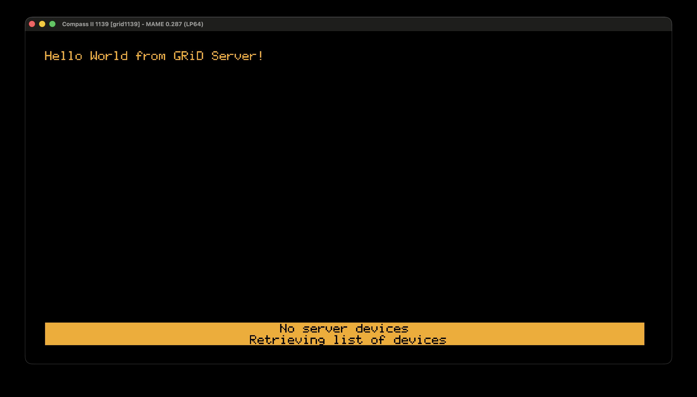

# Connecting GRiD Compass to the Outside World

This is a reverse-engineering project for the built-in modem and a software implementation of GRiD Server.

There is no modem documentation yet, GRiD Server currently works only with a single Message of the Day file, and the Wi-Fi card has not been assembled.

Still, I decided to publish it as-is, even before preparing the MAME PR with HLE modem emulation. Because why not.
